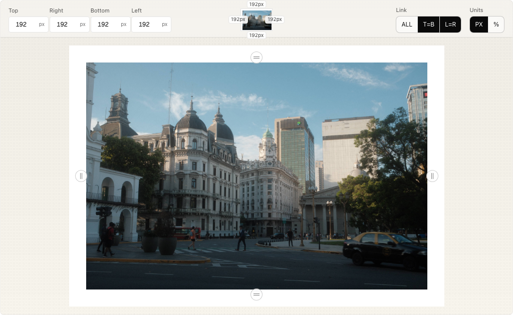

# Cadro

Add clean borders to images. Drag, adjust, and export crisp PNGs — all in the browser.



## Highlights

- Precise border controls with live preview
- Drag-and-drop or use the file picker
- One-click export to a crisp PNG

## Quick start

```bash
pnpm install
pnpm dev
```

Visit `http://localhost:3000`.

## Usage

1. Drop an image onto the stage or use the file picker.
2. Adjust border values using the controls.
3. Click Export to download the bordered PNG.

## Tech

- Next.js 15
- React 19
- Tailwind CSS 4

## Scripts

```bash
pnpm dev        # run the app locally
pnpm build      # production build
pnpm start      # start the built app
pnpm lint       # check lint
pnpm lint:fix   # fix lint
```

## Project structure

- `app/` — Next.js app routes
- `components/` — UI components
- `lib/` — shared types and utilities
- `public/` — static assets
- `scripts/` — automation

## Open Graph image (optional)

This repo includes a social image route at `app/opengraph-image.tsx` and a helper to refresh the screenshot used in previews.

```bash
# optional: regenerate public/og.png via Playwright
pnpm add -D playwright
pnpm og:capture
```

Preview at `/opengraph-image` if you need to customize it.
